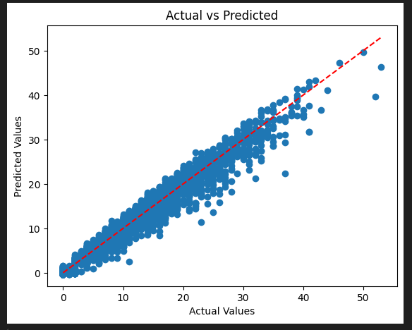
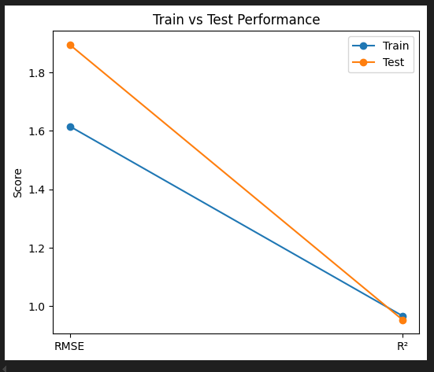

# NBA-EDA-and-Model-Tuning

## Overview
This project performs **Exploratory Data Analysis (EDA)** and **Machine Learning Model Tuning** on NBA player data to predict the number of single-game (PTS). We will make these predictions based on the numerical metrics in the dataset. The dataset is provided on Kaggle and was created by Eduardo Palmieri. The dataset can be found [here](https://www.kaggle.com/datasets/eduardopalmieri/nba-player-stats-season-2425/data).

This repository includes two Jupyter notebooks:
- Exploratory_Data_Analysis.ipynb
- model_and_model_tuning.ipynb

## Project Goal
- Understand the statisical relationship between NBA player features and total points scored
- Use regression techniques to **predict points** based on **numerical features**
- Tune advanced models to improve accuracy
- Evalute model performance using standard scoring metrics 

## Exploratory Data Analysis
The Exploratory Data Analysis section of this project contains features like a clean, structured EDA notebook, correlation heatmaps and descriptive statistics, along with feature engineering and data preprocessing. 

**EDA Steps**
- 1. Basic Analysis - Read the CSV file: Get the shape of the dataset, use the 'head()' function to see some data in the dataset, and see the dtypes in the dataset.
- 2. Data Cleaning - Handle missing values, seperating the numerical and categorical columns 
- 3. Data Visualization - Created histograms to see distribution of numerical values, create correlation heatmap to see correlation to points 
- 4. Create numerical dataset 

### Visualizations in EDA:
 

## Model and Model Tuning

### Features
Based of the EDA I selected 6 numerical features from our numerical dataset to train the models.
- MP
- FG
- FGA
- 3P
- TRB
- AST 

### Machine Learning Models
Since we are trying to predict single-game PTS we will be using regression models. The models I selected to use are Linear Regression, Random Forest Regressor, Gradient Boosting Regressor (GBR), and K-Nearest Neighbors (KNN). These models contain hyperparemeter tuning (GridSearchCV/ RandomizedSearchCV). There is a ready-to-extend pipline to help with future predictions. 

### Visualizations
Linear Regression:

Random Forest Regressor:

## Technologies Used

### Tools
- Python 3.12.3
- VSCode
- Jupyter Notebook

## Libraries
- EDA: pandas, matplotlib, seaborn
- Model and Model Tuning: pandas, matplotlib, seaborn, numpy, sci-kit learn 

## Usage
    1. Clone the repository
        git clone https://github.com/KylePineiroCode/NBA_PTS_Predictor.git
    2. Install dependencies
        pip install -r requirements.txt
    3. Open the Notebooks
        Move to notebooks directory
        Follow the notebooks step-by-step